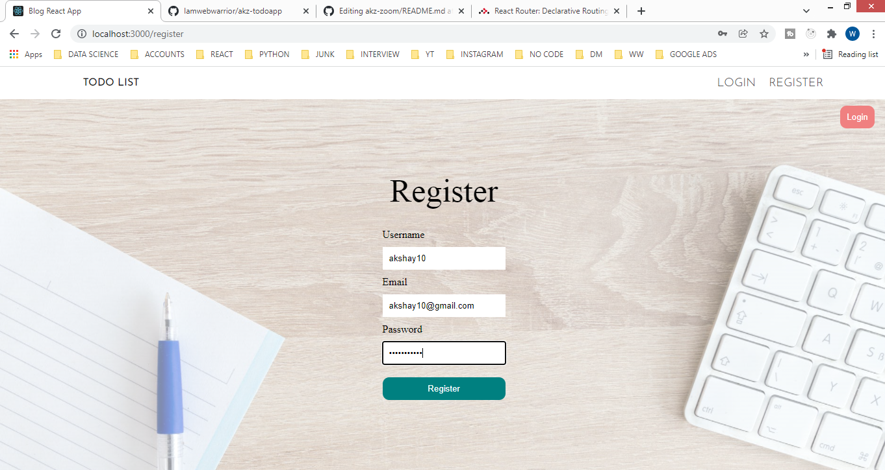
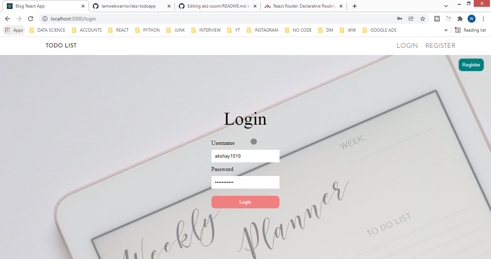
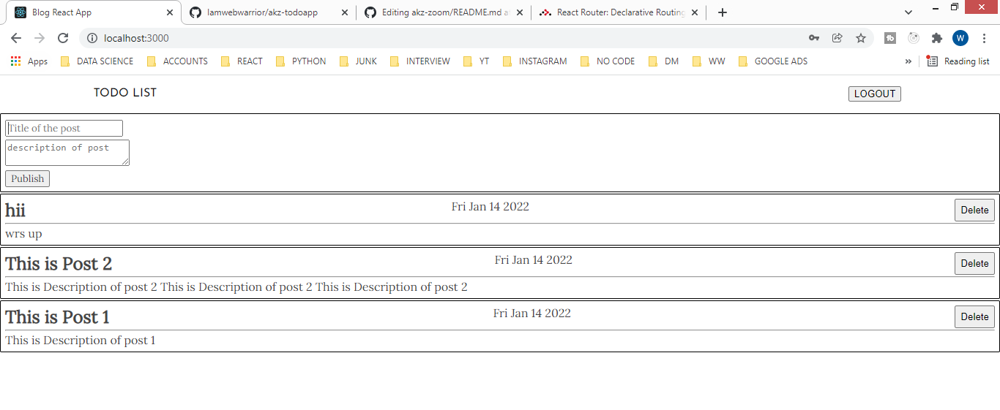

# TODO APP

this is the todo app where u can log in and make todo list
<br/>


## How to use this app
steps:<br/>
step 1:cd BACKEND<br/>
step 2:node index.js<br/>
step 3:cd FRONTEND<br/>
step 4: npm start<br/>
step 5: click the link belove<br/>
<div align="center">
<pre>
<a href="http://localhost:3000/">http://localhost:3000/</a>
</pre>
</div>


## Technologies Used In project are as follows

```
=======
#TECHNOLOGY USED AT FRONTEND


 1) REACT
 2) AXIOS
 3) CSS
 4) HTML

#TECHNOLOGY USED AT BACKEND
1)bcrypt
2)cors
3)dotenv
4)express
5)helmet
6)mongoose
7)morgan
8)nodemon
9)path

## SCREENSHOTS
==================
<video width="320" height="240" controls>
  <source src="https://youtu.be/DP7f3NJdHf0" type="video/mp4">
  <source src="movie.ogg" type="video/ogg">
  Your browser does not support the video tag.
</video>

```



